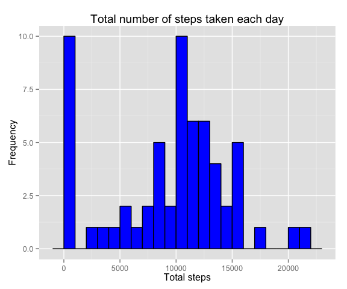
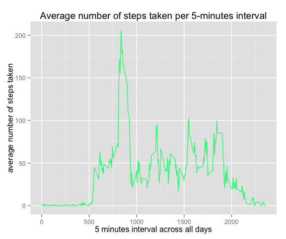
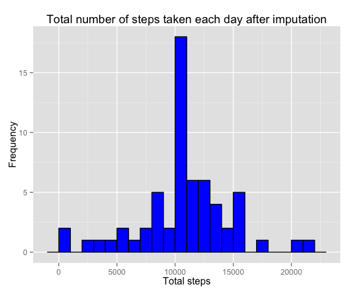
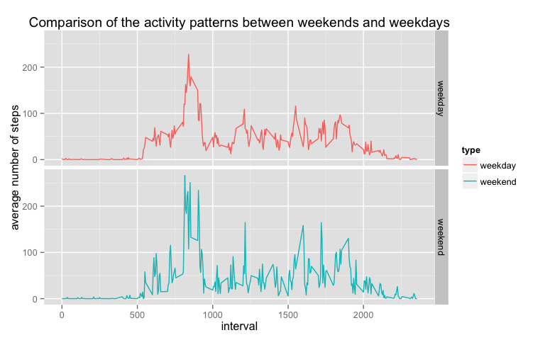

# Reproducible Research: Peer Assessment 1
_**Jiqing Huang**_

### Loading and preprocessing the data
This assignment makes use of data from a personal activity monitoring device. This device collects data at 5 minute intervals through out the day. The data consists of two months of data from an anonymous individual collected during the months of October and November, 2012 and include the number of steps taken in 5 minute intervals each day.

Load the data:

```r
library(ggplot2)
library(plyr)
unzip("repdata-data-activity.zip")
dat <- read.csv('activity.csv', header = T)
dat$date <- as.Date(dat$date)
str(dat)
```

```
## 'data.frame':	17568 obs. of  3 variables:
##  $ steps   : int  NA NA NA NA NA NA NA NA NA NA ...
##  $ date    : Date, format: "2012-10-01" "2012-10-01" ...
##  $ interval: int  0 5 10 15 20 25 30 35 40 45 ...
```


### What is mean total number of steps taken per day?

First calculate the total steps for each day follows:

```r
dat.sum <- ddply(dat, "date", summarize, total.steps = sum(steps, na.rm = TRUE))
head(dat.sum)
```

```
##         date total.steps
## 1 2012-10-01           0
## 2 2012-10-02         126
## 3 2012-10-03       11352
## 4 2012-10-04       12116
## 5 2012-10-05       13294
## 6 2012-10-06       15420
```


##### (1). Then make a histogram of the total number of steps taken each day

```r
ggplot(dat.sum, aes(x = total.steps)) + 
  geom_histogram(binwidth= 1000, colour="black", fill="blue") + 
  labs(title = "Total number of steps taken each day", y = "Frequency",  x = "Total steps") 
```



##### (2). Calculate and report the mean and median tatal number of steps taken per day

```r
as.integer( with(dat.sum, mean(total.steps)) )
```

```
## [1] 9354
```

```r
as.integer( with(dat.sum, median(total.steps)) )
```

```
## [1] 10395
```

### What is the average daily activity pattern?

##### (1). Make a time series plot of the 5-minute interval and the average number of steps taken, averaged across all days

Create a new dataframe dat.avg with the average number of steps per 5-minutes interval, using the `ddply` function, and make a time series plot.


```r
dat.avg <- ddply(dat, "interval", summarize, average.steps = mean(steps, na.rm = TRUE))
head(dat.avg)
```

```
##   interval average.steps
## 1        0       1.71698
## 2        5       0.33962
## 3       10       0.13208
## 4       15       0.15094
## 5       20       0.07547
## 6       25       2.09434
```

```r
ggplot(dat.avg, aes(x = interval, y = average.steps)) + 
  geom_line(color = "springgreen") + 
  labs(title = "Average number of steps taken per 5-minutes interval", 
       y = "average number of steps taken",  x = "5 minutes interval across all days") 
```



##### (2). Find the 5-minute interval that contains the maximum number of steps, on average across all the days in the dataset, using the which.max function:

```r
index <- with(dat.avg, which.max(average.steps))
dat.avg[index, ]
```

```
##     interval average.steps
## 104      835         206.2
```


### Imputing missing values

##### (1). Calculate and report the total number of missing values in the dataset 

```r
with(dat, sum(is.na(steps)))
```

```
## [1] 2304
```

```r
with(dat, table(is.na(steps)))
```

```
## 
## FALSE  TRUE 
## 15264  2304
```
##### (2). Devise a strategy for filling in all of the missing values in the dataset 
   Strategy to fill missing data: replacing it by the average number of steps during the 5-minutes interval.

##### (3).  Create a new dataset that is equal to the original dataset but with the missing data filled in

Using for loop, find the missing value for each row, then replace NA with corresponding value in 
dat.avg


```r
dat.filled <- dat
for (i in 1:dim(dat.filled)[1]){
  if ( is.na(dat.filled[i, 1]) ){
    specific.int = dat.filled[i, 3]
    index = which(dat.avg$interval == specific.int)
    dat.filled[i, 1] <- dat.avg[index, 2]
  }
}
```
Then check if all the rows complete

```r
sum(!complete.cases(dat.filled))
```

```
## [1] 0
```


##### (4).  Make a histogram of the total number of steps taken each day and Calculate and report the mean and median total number of steps taken per day

```r
dat.sum2 <- ddply(dat.filled, "date", summarize, total.steps = sum(steps))

ggplot(dat.sum2, aes(x = total.steps)) + 
  geom_histogram(binwidth= 1000, colour="black", fill="blue") + 
  labs(title = "Total number of steps taken each day after imputation", y = "Frequency",  x = "Total steps") 
```


Report the mean and median

```r
as.integer(with(dat.sum2, mean(total.steps)))
```

```
## [1] 10766
```

```r
as.integer(with(dat.sum2, median(total.steps)))
```

```
## [1] 10766
```

**Mean steps** taken with the **original data** containing missing data: **9354**

**Mean steps** taken with the **imputed data**: **10395**

**Median steps** taken with the **original data** containing missing data: **10766**

**Median steps** taken with the **imputed data**: **10766**

**Impact of imputing the missing data with average number of steps taken per 5 minute interval**: Compared to the histogram drawn from data having missing values, 
the histogrm drawn from the imputed data seems to be more normal, 
because it imputed the missing values with average number 
of steps taken per day.


### Are there differences in activity patterns between weekdays and weekends?

##### (1).  Create a new factor variable in the dataset with two levels – “weekday” and “weekend”, and create a new data frame data.avg2 with the average number of steps per 5-minutes interval for weenkend and weekdays, using the `ddply` function: 

```r
dat.filled$days <- weekdays(dat.sum2$date)
dat.filled$type <- NULL
for (i in 1:dim(dat.filled)[1]){
  if (dat.filled$days[i] == "Saturday" | dat.filled$days[i] == "Sunday"){
    dat.filled$type[i] <- "weekend"
  }
  else{
    dat.filled$type[i] <- "weekday"
  }
}
dat.avg2 <- ddply(dat.filled, c("interval", "type"), summarize, average.steps = mean(steps, na.rm = TRUE))
head(dat.avg2, 10)
```

```
##    interval    type average.steps
## 1         0 weekday      2.327463
## 2         0 weekend      0.000000
## 3         5 weekday      0.452830
## 4         5 weekend      0.021226
## 5        10 weekday      0.164361
## 6        10 weekend      0.041274
## 7        15 weekday      0.191195
## 8        15 weekend      0.037736
## 9        20 weekday      0.098952
## 10       20 weekend      0.009434
```


##### (2).  Make a panel plot containing a time series plot of the 5-minute interval and the average number of steps taken, averaged across all weekday days or weekend days.

```r
ggplot(dat.avg2, aes(x= interval , y = average.steps, color = type)) + 
  geom_line(size = 0.5) + 
  labs(title = "Comparison of the activity patterns between weekends and weekdays", 
       y = "average number of steps",  x = "interval") + facet_grid(type ~ .) 
```




